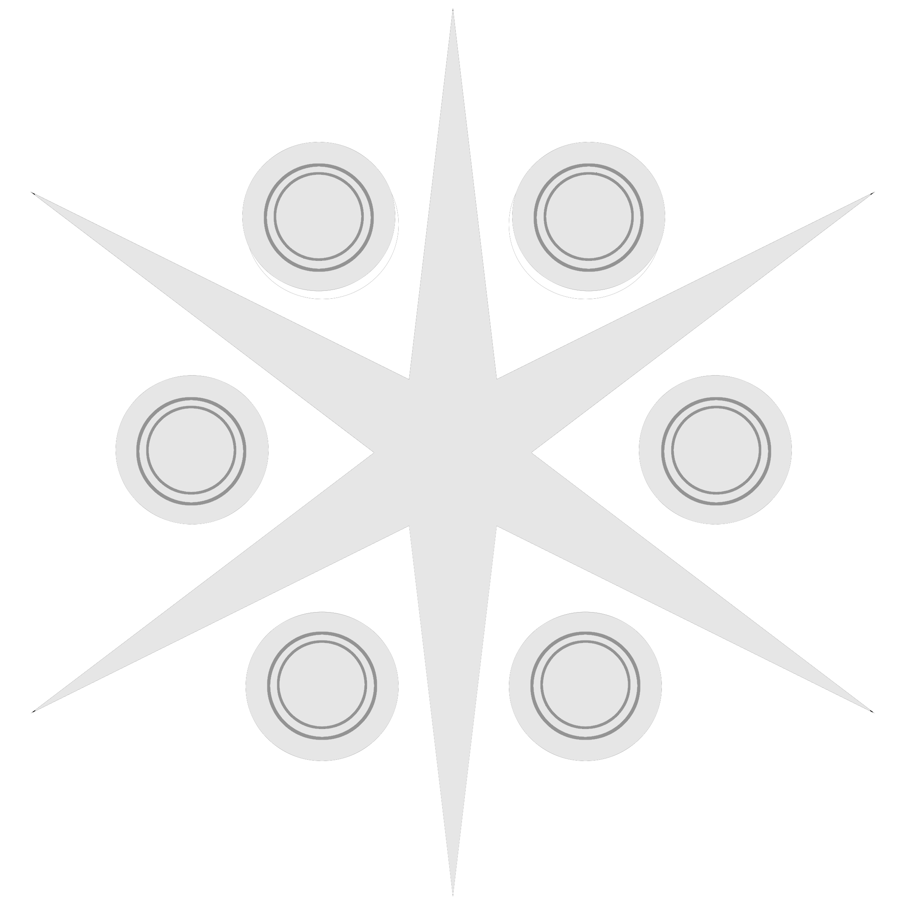

<html lang="en">
<head>
<meta charset="UTF-8">
<meta name="viewport" content="width=device-width, initial-scale=1.0">
<title>ARGOS TRIGGER HANGAR</title>
<link href="https://fonts.googleapis.com/css2?family=Rajdhani:wght@500;700&family=Inter:wght@300;400;500&family=Share+Tech+Mono&display=swap" rel="stylesheet">

</head>
<body>
<audio id="bgMusic" loop>
  <source src="audio/hangar_theme.mp3" type="audio/mpeg">
</audio>
<header>

ARGOS TRIGGER HANGAR

<button id="musicToggle">Music: Off</button>

<input id="passwordInput" type="password" placeholder="Password" style="background:#000;color:#fff;border:1px solid #333;padding:6px 8px;border-radius:4px;outline:none">
<button id="authorizeBtn" style="padding:6px 10px;background:#222;color:white;border:1px solid #444;border-radius:4px;cursor:pointer">Authorize</button>

</header>
<button id="addMech" style="display:none">Add Mech</button>
<button id="saveData">Save Data</button>

<template id="mechTemplate">

<button class="fullRepairBtn">Full Repair</button>

<input type="file" style="display:none">
<button class="uploadBtn">Upload Image</button>

<h2><input value="New Mech"></h2>

<label>HP</label><input type="number" value="10">/<input type="number" value="10">

<label>Heat</label><input type="number" value="0">/<input type="number" value="6">

<label>Repairs</label><input type="number" value="3">/<input type="number" value="3">

<label>Structure</label>

<label>Stress</label>

<label>Core Power</label>
<button class="coreBtn charged">Charged</button>

<label>Overcharge</label>
<select>
<option>+1</option>
<option>1d3</option>
<option>1d6</option>
<option>1d6+4</option>
</select>

<b>Weapons</b>

<button class="small addWeapon">Add Weapon</button>
<button class="small addLimitedWeapon">Add Limited Weapon</button>

<b>Systems</b>

<button class="small addSystem">Add System</button>
<button class="small addLimited">Add Limited System</button>

</template>

